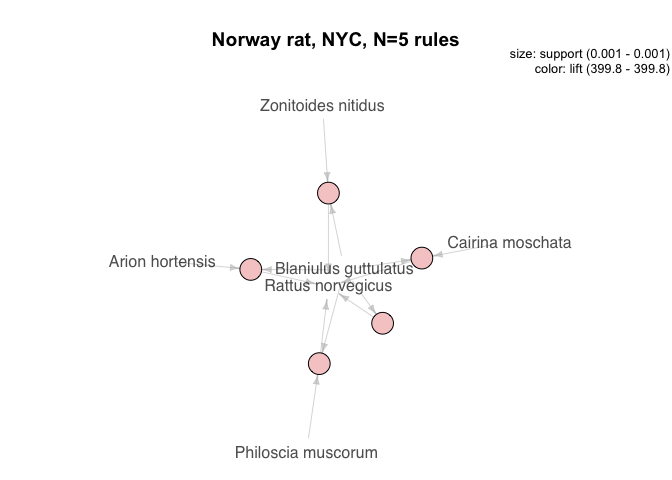
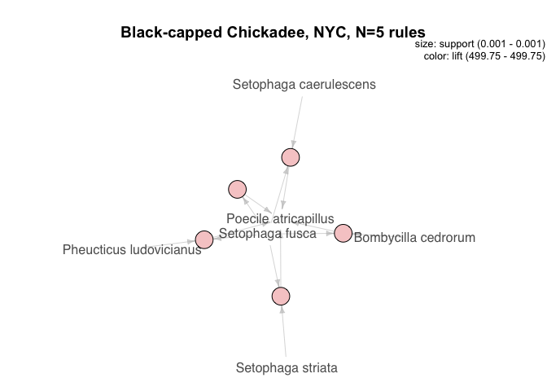
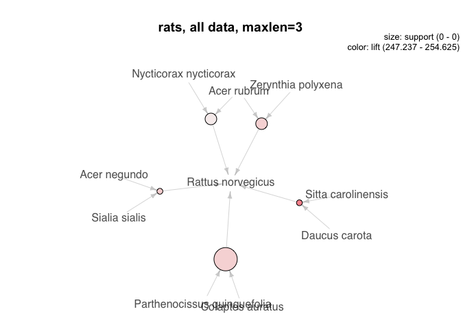
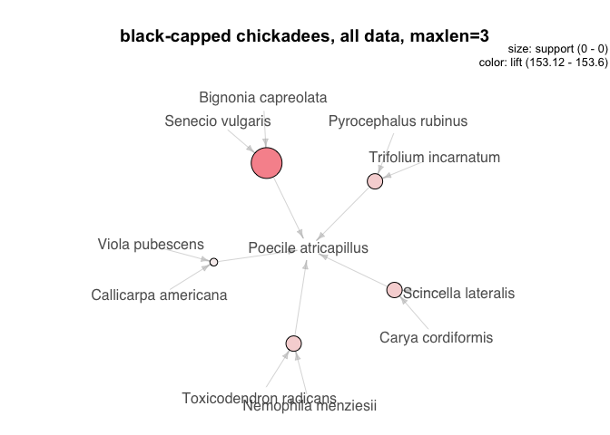
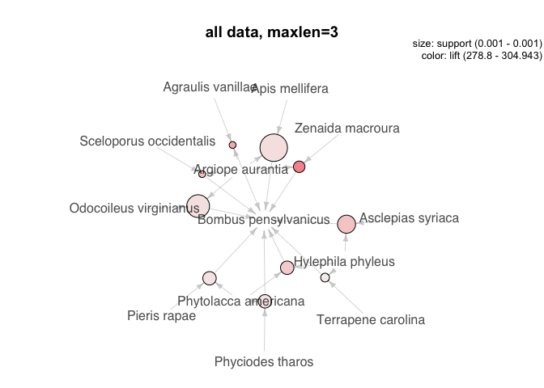
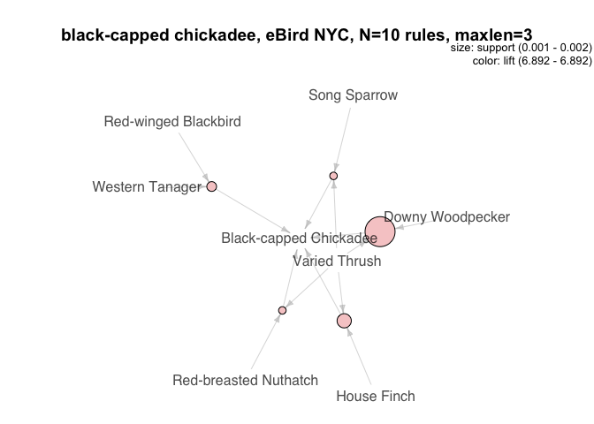
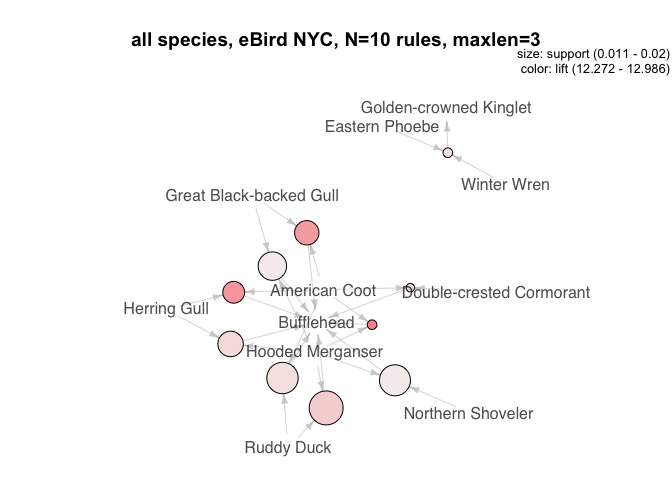

rules
================
Ilya
5/13/2018

install packages
================

``` r
#install package dplyr if not already installed
list.of.packages <- c("dplyr", "rgdal", "raster", "sp", "data.table", "reshape", "auk", "lubridate", "apriori", "arulesViz")
new.packages <- list.of.packages[!(list.of.packages %in% installed.packages()[,"Package"])]
if(length(new.packages)) install.packages(new.packages, repos = "http://cran.us.r-project.org")
```

    ## Warning: package 'apriori' is not available (for R version 3.4.4)

``` r
print(new.packages)
```

    ## [1] "apriori"

``` r
library(dplyr)
```

    ## 
    ## Attaching package: 'dplyr'

    ## The following objects are masked from 'package:stats':
    ## 
    ##     filter, lag

    ## The following objects are masked from 'package:base':
    ## 
    ##     intersect, setdiff, setequal, union

``` r
library(auk)
```

    ## auk 0.2.0 functions with EBD files downloaded after March 15, 2018.
    ## See ?auk_version_date for details.

``` r
library(lubridate)
```

    ## 
    ## Attaching package: 'lubridate'

    ## The following object is masked from 'package:base':
    ## 
    ##     date

``` r
library(reshape)
```

    ## 
    ## Attaching package: 'reshape'

    ## The following object is masked from 'package:lubridate':
    ## 
    ##     stamp

    ## The following object is masked from 'package:dplyr':
    ## 
    ##     rename

``` r
library(arules)
```

    ## Loading required package: Matrix

    ## 
    ## Attaching package: 'Matrix'

    ## The following object is masked from 'package:reshape':
    ## 
    ##     expand

    ## 
    ## Attaching package: 'arules'

    ## The following object is masked from 'package:dplyr':
    ## 
    ##     recode

    ## The following objects are masked from 'package:base':
    ## 
    ##     abbreviate, write

``` r
library(data.table)
```

    ## 
    ## Attaching package: 'data.table'

    ## The following object is masked from 'package:reshape':
    ## 
    ##     melt

    ## The following objects are masked from 'package:lubridate':
    ## 
    ##     hour, isoweek, mday, minute, month, quarter, second, wday,
    ##     week, yday, year

    ## The following objects are masked from 'package:dplyr':
    ## 
    ##     between, first, last

``` r
library(arulesViz)
```

    ## Loading required package: grid

read in shapefile of protected areas and reproject and save as PAD\_wgs84.Rdata -- commenting out this part
===========================================================================================================

``` r
#   library("rgdal")
#  library("raster") 
# library("sp")
# 
# #source: https://gapanalysis.usgs.gov/padus/data/download/
# PAD <- shapefile("PADUS1_4Combined.shp")
# #change datum
# PAD_wgs84 <- spTransform(PAD, CRS("+proj=longlat +datum=WGS84"))
# 
# #assign cooordinates (package: sp)
# PAD_coordinates = coordinates(PAD_wgs84)
# print(proc.time() - ptm)
# 
# PAD_wgs84$X = PAD_coordinates[,1]
# PAD_wgs84$Y = PAD_coordinates[,2]
# 
# save(PAD_wgs84, file = "PAD_wgs84.Rdata")
```

#### read in iNaturalist data and assign it to parks -- commenting out this part

``` r
# rm(list = ls())
# library("raster")
# library("data.table")
# load("PAD_wgs84.Rdata")
# 
# #occurrence download available here: 
# #https://www.gbif.org/occurrence/download/0016851-180131172636756
# inat = fread("occurrence.txt",blank.lines.skip=TRUE)
# inat = as.data.frame(inat)
# inat$longitude <- inat$decimalLongitude
# inat$latitude <- inat$decimalLatitude
# inat.ok= filter(inat, !is.na(decimalLatitude) & !is.na(decimalLongitude))
# 
# #turn it into a SpatialPointsDataFrame
# coordinates(inat.ok) <- c("decimalLongitude","decimalLatitude")#package sp
# 
# save(inat.ok,file = "inat.ok.Rdata")
# 
#  # tell R that inat coordinates are in the same lat/lon reference system
# # as the parks data 
# projection(inat.ok) <- projection(PAD_wgs84)
# 
# # use 'over' with parks as a SpatialPolygonsDataFrame
# # object, to determine which park (if any) contains each sighting, and
# # store the park name as an attribute of the data
# inat.ok$park <- over(inat.ok, PAD_wgs84)$Unit_Nm#name of park
# inat.ok$X.park <- over(inat.ok, PAD_wgs84)$X
# inat.ok$Y.park <- over(inat.ok, PAD_wgs84)$Y
# inat.ok$park.acres <- over(inat.ok, PAD_wgs84)$GIS_Acres
# 
# save(inat.ok, file = "inat.ok.Rdata")
```

make small version of data
==========================

``` r
load("inat.ok.Rdata")
inat.ok$date =  as.Date(paste(inat.ok$year, inat.ok$month, inat.ok$day, sep='-'))
```

    ## Loading required package: sp

``` r
inat.ok.sm = inat.ok[, c("park", "recordedBy", "species", "date", "X.park", "Y.park")]
save(inat.ok.sm, file = "inat.ok.sm.Rdata")
```

#### subset data for NYC

``` r
load("inat.ok.sm.Rdata")
inat.nyc = subset(inat.ok,X.park >=-74.2589 & X.park< -73.7004 & Y.park <=40.9176 & Y.park>=40.4774)
write.csv(inat.nyc, file = "inat.nyc.csv")
```

find association rules for rats in NYC; plot strongly supported associations
============================================================================

``` r
inat.nyc = read.csv("inat.nyc.csv")
inat.ok = inat.nyc
inat.df = as.data.frame(inat.ok) 

#get count by park, date, and species for all data
inat.ct <- inat.df %>%
    group_by(park, date, species) %>%
  summarize(count = n())
inat.ct$count = 1#make all counts 1
 inat.ct = data.frame(inat.ct)
 inat.ct$park_date_recordedBy = factor(paste(inat.ct$park, inat.ct$date, inat.ct$recordedBy, sep = "_"))
  inat.ct$park_date = factor(paste(inat.ct$park, inat.ct$date, sep = "_"))
 i.df = inat.ct[, c("park_date_recordedBy", "park_date", "species", "count")]
#write and then read back in again as transaction
  write.csv(i.df, file = "i.df.csv")
 
itrans = read.transactions("i.df.csv", format = "single", sep = ",", cols = c("park_date_recordedBy", "species"))

#find all rules involving Norway rats
irulesRaNo <- apriori(itrans, parameter = list(support = 0.0001, confidence = 0.2, maxlen=3), appearance = list(rhs="Rattus norvegicus"))# 
```

    ## Apriori
    ## 
    ## Parameter specification:
    ##  confidence minval smax arem  aval originalSupport maxtime support minlen
    ##         0.2    0.1    1 none FALSE            TRUE       5   1e-04      1
    ##  maxlen target   ext
    ##       3  rules FALSE
    ## 
    ## Algorithmic control:
    ##  filter tree heap memopt load sort verbose
    ##     0.1 TRUE TRUE  FALSE TRUE    2    TRUE
    ## 
    ## Absolute minimum support count: 0 
    ## 
    ## set item appearances ...[1 item(s)] done [0.00s].
    ## set transactions ...[1593 item(s), 1999 transaction(s)] done [0.00s].
    ## sorting and recoding items ... [1593 item(s)] done [0.00s].
    ## creating transaction tree ... done [0.00s].
    ## checking subsets of size 1 2 3

    ## Warning in apriori(itrans, parameter = list(support = 1e-04, confidence =
    ## 0.2, : Mining stopped (maxlen reached). Only patterns up to a length of 3
    ## returned!

    ##  done [0.06s].
    ## writing ... [163 rule(s)] done [0.04s].
    ## creating S4 object  ... done [0.01s].

``` r
subrulesRaNo <- head(irulesRaNo, n = 5, by = "lift")
plot(subrulesRaNo, method = "graph", main = "Norway rat, NYC, N=5 rules")
```



``` r
#find all rules for black-capped chickadees:
irulesBlCa <- apriori(itrans, parameter = list(support = 0.0001, confidence = 0.2, maxlen=3), appearance = list(rhs="Poecile atricapillus"))# 
```

    ## Apriori
    ## 
    ## Parameter specification:
    ##  confidence minval smax arem  aval originalSupport maxtime support minlen
    ##         0.2    0.1    1 none FALSE            TRUE       5   1e-04      1
    ##  maxlen target   ext
    ##       3  rules FALSE
    ## 
    ## Algorithmic control:
    ##  filter tree heap memopt load sort verbose
    ##     0.1 TRUE TRUE  FALSE TRUE    2    TRUE
    ## 
    ## Absolute minimum support count: 0 
    ## 
    ## set item appearances ...[1 item(s)] done [0.00s].
    ## set transactions ...[1593 item(s), 1999 transaction(s)] done [0.00s].
    ## sorting and recoding items ... [1593 item(s)] done [0.00s].
    ## creating transaction tree ... done [0.00s].
    ## checking subsets of size 1 2 3

    ## Warning in apriori(itrans, parameter = list(support = 1e-04, confidence =
    ## 0.2, : Mining stopped (maxlen reached). Only patterns up to a length of 3
    ## returned!

    ##  done [0.05s].
    ## writing ... [57 rule(s)] done [0.05s].
    ## creating S4 object  ... done [0.01s].

``` r
subrulesBlCa <- head(irulesBlCa, n = 5, by = "lift")
plot(subrulesBlCa, method = "graph", main = "Black-capped Chickadee, NYC, N=5 rules")
```



find association rules across all iNaturalist data
==================================================

``` r
load("inat.ok.sm.Rdata")
inat.df = inat.ok.sm
inat.df = data.frame(inat.df)
#get count by park, date, and species for all data
inat.ct <- inat.df %>%
    group_by(park, date, species) %>%
  summarize(count = n())
inat.ct$count = 1#make all counts 1
 inat.ct = data.frame(inat.ct)
 inat.ct$park_date_recordedBy = factor(paste(inat.ct$park, inat.ct$date, inat.ct$recordedBy, sep = "_"))
  inat.ct$park_date = factor(paste(inat.ct$park, inat.ct$date, sep = "_"))
 i.df = inat.ct[, c("park_date_recordedBy", "park_date", "species", "count")]
#write and then read back in again as transaction
  write.csv(i.df, file = "i.df.csv")
 
itrans = read.transactions("i.df.csv", format = "single", sep = ",", cols = c("park_date_recordedBy", "species"))

#find all rules involving Norway rats
  irulesRaNo <- apriori(itrans, parameter = list(support = 0.0001, confidence = 0.05, maxlen=3), appearance = list(rhs="Rattus norvegicus"))# 
```

    ## Apriori
    ## 
    ## Parameter specification:
    ##  confidence minval smax arem  aval originalSupport maxtime support minlen
    ##        0.05    0.1    1 none FALSE            TRUE       5   1e-04      1
    ##  maxlen target   ext
    ##       3  rules FALSE
    ## 
    ## Algorithmic control:
    ##  filter tree heap memopt load sort verbose
    ##     0.1 TRUE TRUE  FALSE TRUE    2    TRUE
    ## 
    ## Absolute minimum support count: 27 
    ## 
    ## set item appearances ...[1 item(s)] done [0.00s].
    ## set transactions ...[31546 item(s), 272131 transaction(s)] done [0.34s].
    ## sorting and recoding items ... [7652 item(s)] done [0.04s].
    ## creating transaction tree ... done [0.15s].
    ## checking subsets of size 1 2 3

    ## Warning in apriori(itrans, parameter = list(support = 1e-04, confidence =
    ## 0.05, : Mining stopped (maxlen reached). Only patterns up to a length of 3
    ## returned!

    ##  done [26.85s].
    ## writing ... [2760 rule(s)] done [3.66s].
    ## creating S4 object  ... done [0.60s].

``` r
subrulesRaNo <- head(irulesRaNo, n = 5, by = "lift")
plot(subrulesRaNo, method = "graph", main = "rats, all data, maxlen=3")
```



``` r
#find all rules for black-capped chickadees:
irulesBlCa <- apriori(itrans, parameter = list(support = 0.0001, confidence = 0.1, maxlen=3), appearance = list(rhs="Poecile atricapillus"))# 
```

    ## Apriori
    ## 
    ## Parameter specification:
    ##  confidence minval smax arem  aval originalSupport maxtime support minlen
    ##         0.1    0.1    1 none FALSE            TRUE       5   1e-04      1
    ##  maxlen target   ext
    ##       3  rules FALSE
    ## 
    ## Algorithmic control:
    ##  filter tree heap memopt load sort verbose
    ##     0.1 TRUE TRUE  FALSE TRUE    2    TRUE
    ## 
    ## Absolute minimum support count: 27 
    ## 
    ## set item appearances ...[1 item(s)] done [0.00s].
    ## set transactions ...[31546 item(s), 272131 transaction(s)] done [0.27s].
    ## sorting and recoding items ... [7652 item(s)] done [0.04s].
    ## creating transaction tree ... done [0.14s].
    ## checking subsets of size 1 2 3

    ## Warning in apriori(itrans, parameter = list(support = 1e-04, confidence =
    ## 0.1, : Mining stopped (maxlen reached). Only patterns up to a length of 3
    ## returned!

    ##  done [22.40s].
    ## writing ... [615810 rule(s)] done [3.84s].
    ## creating S4 object  ... done [0.56s].

``` r
subrulesBlCa <- head(irulesBlCa, n = 5, by = "lift")
plot(subrulesBlCa, method = "graph", main = "black-capped chickadees, all data, maxlen=3")
```



``` r
#find all rules, include maxlen of 3
irules <- apriori(itrans, parameter = list(support = 0.001, confidence = 0.1, maxlen=3))# 
```

    ## Apriori
    ## 
    ## Parameter specification:
    ##  confidence minval smax arem  aval originalSupport maxtime support minlen
    ##         0.1    0.1    1 none FALSE            TRUE       5   0.001      1
    ##  maxlen target   ext
    ##       3  rules FALSE
    ## 
    ## Algorithmic control:
    ##  filter tree heap memopt load sort verbose
    ##     0.1 TRUE TRUE  FALSE TRUE    2    TRUE
    ## 
    ## Absolute minimum support count: 272 
    ## 
    ## set item appearances ...[0 item(s)] done [0.00s].
    ## set transactions ...[31546 item(s), 272131 transaction(s)] done [0.27s].
    ## sorting and recoding items ... [1418 item(s)] done [0.03s].
    ## creating transaction tree ... done [0.11s].
    ## checking subsets of size 1 2 3

    ## Warning in apriori(itrans, parameter = list(support = 0.001, confidence =
    ## 0.1, : Mining stopped (maxlen reached). Only patterns up to a length of 3
    ## returned!

    ##  done [0.46s].
    ## writing ... [956293 rule(s)] done [0.07s].
    ## creating S4 object  ... done [0.21s].

``` r
subrules <- head(irules, n = 10, by = "lift")
plot(subrules, method = "graph", main = "all data, maxlen=3")
```



##### read in basic (not reference) ebird data

``` r
rm(list = ls())
input_file = "/Users/fischhoff/app_wild/bird_basic_NY_NY/ebd_US-NY-061_relFeb-2018.txt"

output_file = "/Users/fischhoff/app_wild/bird_basic_NY_NY/ebd_US-NY-061_relFeb-2018clean.txt"
auk_clean(input_file, output_file, overwrite=TRUE)
```

    ## [1] "/Users/fischhoff/app_wild/bird_basic_NY_NY/ebd_US-NY-061_relFeb-2018clean.txt"

``` r
ebd_NYNY = read_ebd(output_file)
```

find association rules in eBird NYC data
========================================

``` r
write.csv(ebd_NYNY, file = "ebd_NYNY.csv")
etrans = read.transactions("ebd_NYNY.csv", format = "single", sep = ",", cols = c("checklist_id", "common_name"))

erulesBlCa <- apriori(etrans, parameter = list(support = 0.001, confidence = 0.6, maxlen=3), appearance = list(rhs="Black-capped Chickadee"))#could re-run with 
```

    ## Apriori
    ## 
    ## Parameter specification:
    ##  confidence minval smax arem  aval originalSupport maxtime support minlen
    ##         0.6    0.1    1 none FALSE            TRUE       5   0.001      1
    ##  maxlen target   ext
    ##       3  rules FALSE
    ## 
    ## Algorithmic control:
    ##  filter tree heap memopt load sort verbose
    ##     0.1 TRUE TRUE  FALSE TRUE    2    TRUE
    ## 
    ## Absolute minimum support count: 7 
    ## 
    ## set item appearances ...[1 item(s)] done [0.00s].
    ## set transactions ...[284 item(s), 7884 transaction(s)] done [0.01s].
    ## sorting and recoding items ... [214 item(s)] done [0.00s].
    ## creating transaction tree ... done [0.00s].
    ## checking subsets of size 1 2 3

    ## Warning in apriori(etrans, parameter = list(support = 0.001, confidence =
    ## 0.6, : Mining stopped (maxlen reached). Only patterns up to a length of 3
    ## returned!

    ##  done [0.04s].
    ## writing ... [531 rule(s)] done [0.00s].
    ## creating S4 object  ... done [0.00s].

``` r
subrulesBlCa <- head(erulesBlCa, n = 5, by = "lift")
plot(subrulesBlCa, method = "graph", main = "black-capped chickadee, eBird NYC, N=10 rules, maxlen=3")
```



``` r
erules <- apriori(etrans, parameter = list(support = 0.01, confidence = 0.6, maxlen=3))#could re-run with 
```

    ## Apriori
    ## 
    ## Parameter specification:
    ##  confidence minval smax arem  aval originalSupport maxtime support minlen
    ##         0.6    0.1    1 none FALSE            TRUE       5    0.01      1
    ##  maxlen target   ext
    ##       3  rules FALSE
    ## 
    ## Algorithmic control:
    ##  filter tree heap memopt load sort verbose
    ##     0.1 TRUE TRUE  FALSE TRUE    2    TRUE
    ## 
    ## Absolute minimum support count: 78 
    ## 
    ## set item appearances ...[0 item(s)] done [0.00s].
    ## set transactions ...[284 item(s), 7884 transaction(s)] done [0.01s].
    ## sorting and recoding items ... [139 item(s)] done [0.00s].
    ## creating transaction tree ... done [0.00s].
    ## checking subsets of size 1 2 3

    ## Warning in apriori(etrans, parameter = list(support = 0.01, confidence =
    ## 0.6, : Mining stopped (maxlen reached). Only patterns up to a length of 3
    ## returned!

    ##  done [0.03s].
    ## writing ... [78992 rule(s)] done [0.01s].
    ## creating S4 object  ... done [0.01s].

``` r
subrules <- head(erules, n = 10, by = "lift")
plot(subrules, method = "graph", main = "all species, eBird NYC, N=10 rules, maxlen=3")
```



``` r
#plot = plot(subrules, method = "grouped")
```
